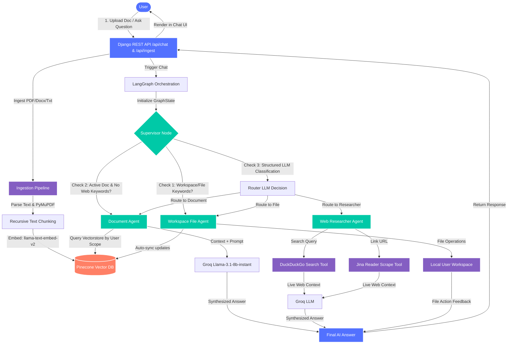

# 🏗️ GraphLens AI Architecture & Flow

This document details the multi-agent orchestration, key components, libraries, and system flow design of the **GraphLens AI** workspace.

---

## 🔄 System Flow Chart

---

## 🧠 Multi-Agent Orchestration

The backend uses **LangGraph** to build a state machine containing a team of specialized agents:

1. **LangGraph Supervisor**: Inspects incoming queries. If the query asks for workspace file operations (e.g. creating/reading files), it routes to the **File Agent**. If the user is viewing a document, it defaults to the **Document Agent**. Otherwise, an LLM classifier selects the best worker.
2. **Document Agent**: Similarity-searches the vectorstore for user-scoped content and constructs grounded answers.
3. **Web Researcher Agent**: Performs DuckDuckGo searches and deep-scrapes specific links via Jina Reader (`https://r.jina.ai/`).
4. **Workspace File Agent**: Creates, reads, appends to, or deletes files in the user directory, automatically syncing edits back into Pinecone database chunks.

---

## 🛠️ Technology Stack & Dependencies

* **Frontend**: HTML5, Vanilla JS & CSS (Custom dark theme with glassmorphism).
* **Backend**: Django & Django REST Framework (DRF).
* **AI Orchestration**: LangChain & LangGraph (agent flow state machine).
* **LLMs**: Groq Chat Engine (`llama-3.1-8b-instant` for reasoning and routing).
* **Vector Database**: Pinecone Serverless (utilizes `llama-text-embed-v2` embeddings for chunk-level semantic searches).
* **Relational Database**: Neon PostgreSQL (connected via `dj-database-url` and `psycopg2-binary` to store user registration, login credentials, and file metadata).
* **Cloud Storage**: AWS S3 (integrated via `boto3` to store, download, and serve original uploaded files using secure 1-hour presigned URLs).
