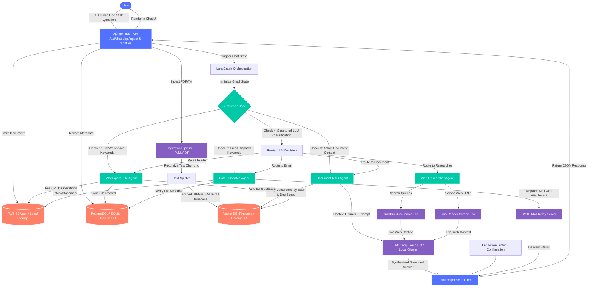

# 🏗️ GraphLens AI Architecture & Flow

This document details the multi-agent orchestration, key components, libraries, and system flow design of the **GraphLens AI** workspace.

> 🌐 **Live Interactive Architecture Explorer**:  
> 👉 **[Launch Interactive Diagram (Full Screen)](https://vinay50029.github.io/GraphLens-AI/architecture.html)**  
> *(Interactive node focus, direct code source links, data flow routes, and dark/light modes)*

---

## 🔄 System Flow Chart

```mermaid
graph TD
    User([User]) -->|1. Upload Doc / Ask Question| DRF[Django REST API /api/chat, /api/ingest & /api/files]
    
    %% Ingestion & Persistence Flow
    DRF -->|Ingest PDF/Txt| Ingest[Ingestion Pipeline - PyMuPDF]
    DRF -->|Store Document| Vault[(AWS S3 Vault / Local Storage)]
    DRF -->|Record Metadata| DB[(PostgreSQL / SQLite - UserFile DB)]
    Ingest -->|Recursive Text Chunking| Chunk[Text Splitter]
    Chunk -->|Embed: all-MiniLM-L6-v2 / Pinecone| VectorDB[(Vector DB: Pinecone / ChromaDB)]
    
    %% Orchestration Flow
    DRF -->|Trigger Chat State| Graph[LangGraph Orchestration]
    Graph -->|Initialize GraphState| Supervisor{Supervisor Node}
    
    %% Routing Logic
    Supervisor -->|Check 1: File/Workspace Keywords| FileAgent[Workspace File Agent]
    Supervisor -->|Check 2: Email Dispatch Keywords| EmailAgent[Email Dispatch Agent]
    Supervisor -->|Check 3: Active Document Context| DocAgent[Document RAG Agent]
    Supervisor -->|Check 4: Structured LLM Classification| RouterLLM[Router LLM Decision]
    
    RouterLLM -->|Route to Document| DocAgent
    RouterLLM -->|Route to Researcher| ResearcherAgent[Web Researcher Agent]
    RouterLLM -->|Route to File| FileAgent
    RouterLLM -->|Route to Email| EmailAgent
    
    %% Agent Execution Details
    DocAgent -->|Query Vectorstore by User & Doc Scope| VectorDB
    DocAgent -->|Context Chunks + Prompt| LLM_Engine[LLM: Groq Llama-3.3 / Local Ollama]
    
    ResearcherAgent -->|Search Queries| DDG[DuckDuckGo Search Tool]
    ResearcherAgent -->|Scrape Web URLs| Scrape[Jina Reader Scrape Tool]
    DDG & Scrape -->|Live Web Context| LLM_Engine
    
    FileAgent -->|File CRUD Operations| Vault
    FileAgent -->|Auto-sync updates| VectorDB
    FileAgent -->|Sync File Record| DB
    
    EmailAgent -->|Fetch Attachment| Vault
    EmailAgent -->|Verify File Metadata| DB
    EmailAgent -->|Dispatch Mail with Attachment| SMTP[SMTP Mail Relay Server]
    
    %% Synthesis & Response
    LLM_Engine -->|Synthesized Grounded Answer| Response[Final Response to Client]
    OS_Feedback[File Action Status / Confirmation] --> Response
    SMTP -->|Delivery Status| Response
    
    Response -->|Return JSON Response| DRF
    DRF -->|Render in Chat UI| User

    classDef main fill:#5271FF,stroke:#fff,stroke-width:2px,color:#fff;
    classDef agent fill:#00C9A7,stroke:#fff,stroke-width:2px,color:#fff;
    classDef database fill:#FF8066,stroke:#fff,stroke-width:2px,color:#fff;
    classDef tool fill:#845EC2,stroke:#fff,stroke-width:2px,color:#fff;
    
    class User,DRF,Response main;
    class Supervisor,FileAgent,DocAgent,ResearcherAgent,EmailAgent agent;
    class VectorDB,Vault,DB database;
    class Ingest,DDG,Scrape,SMTP,LLM_Engine tool;
```

---

## 🧠 Multi-Agent Orchestration

The backend uses **LangGraph** to build an autonomous multi-agent state graph:

1. **LangGraph Supervisor (`supervisor_node`)**: Evaluates incoming queries using deterministic checks (file operations, email intents, active documents) followed by structured LLM classification to route the prompt to the right worker agent.
2. **Document RAG Agent (`document_node`)**: Queries the vectorstore (Pinecone or ChromaDB) filtered strictly by the user's `user_id` and active document names, retrieving relevant chunks for grounded LLM synthesis.
3. **Web Researcher Agent (`researcher_node`)**: Runs a ReAct loop with DuckDuckGo Search and Jina Reader (`r.jina.ai`) to gather live internet facts and clean markdown summaries.
4. **Workspace File Agent (`file_node`)**: Executes file operations (create, read, update, delete, list) on disk and AWS S3, triggering automatic vector re-indexing for edited documents.
5. **Email Dispatch Agent (`email_node`)**: Extracts recipient email and target filename, resolves attachments from storage/database, and transmits emails via central SMTP relay with custom `Reply-To` headers.

---

## 🛠️ Technology Stack & Dependencies

* **Frontend**: HTML5, Vanilla JS & CSS (Glassmorphism dark theme).
* **Backend**: Django & Django REST Framework (DRF).
* **AI Orchestration**: LangChain & LangGraph (StateGraph multi-agent flow).
* **LLM Engine (Hybrid)**:
  * **Cloud**: Groq API (`llama-3.3-70b-versatile`).
  * **Local / Offline**: Ollama (`llama3.1`).
* **Embeddings**: HuggingFace (`all-MiniLM-L6-v2`) & Pinecone Embeddings (`llama-text-embed-v2`).
* **Vector Databases**:
  * **Cloud**: Pinecone Serverless (cosine similarity, 1024-dim).
  * **Local**: ChromaDB (`db/chroma_db`).
* **Relational Database**: PostgreSQL / SQLite with Django ORM `UserFile` model for tenant file tracking.
* **Storage Vault**: AWS S3 Bucket (via `boto3` presigned URLs) + Local filesystem cache (`users/{user_id}/`).
* **Email & External APIs**: SMTP Gateway, DuckDuckGo Search, and Jina Reader API.
