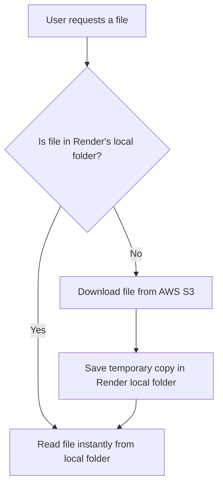

# 📂 File Handling: Local Development vs. Cloud (Render + AWS S3)

This document explains the storage architecture of **GraphLens AI**, specifically how it handles user files when running on a local machine versus a stateless cloud platform like **Render**.

---

## ☁️ The Challenge of Stateless Cloud Servers (Render)

When you run the application on your local PC, writing files to the local disk (`media/users/...`) works perfectly because your computer's hard drive is permanent.

However, when you deploy to cloud platforms like **Render**, the servers are **stateless** (ephemeral):
* Every time you push a new code update, Render rebuilds the project and **wipes the local hard drive clean**.
* If Render is idle, it might spin down (go to sleep). When it wakes up, it starts with a fresh, clean disk.
* **If you only saved files locally on Render, they would be lost forever after a server restart.**

---

## 🛠️ The Solution: Hybrid Storage Architecture

To solve this, the application implements a **Hybrid Local-Cache / Remote-Storage** architecture using **AWS S3** and **local server storage**:

### 1. AWS S3: The Permanent Vault (Single Source of Truth)
* **What it does**: Every file uploaded or created by the user is immediately sent to **AWS S3**.
* **Why it's needed**: S3 is a highly durable cloud storage service. Even if Render restarts 100 times, the files remain safe and permanent in the S3 bucket.

### 2. Local Folder: The Temporary Cache
* **What it does**: The server keeps a temporary copy of active files in the local directory `media/users/[user_id]/`.
* **Why it's needed**:
  1. **Library Compatibility**: Python libraries like `PyMuPDF` (for reading PDFs) and `python-docx` (for Word documents) cannot scan text directly from a cloud URL. They require the file to exist physically on the server's local hard drive to run their parsing algorithms.
  2. **Performance (Speed)**: Reading files from the local disk is nearly instant. Downloading from AWS S3 over the internet every time the user asks a question is slow and incurs network costs.

---

## 🔄 Step-by-Step Lifecycles

### Ingestion (File Upload)
1. The user uploads `report.pdf`.
2. Render parses the file and sends the text chunks to Pinecone.
3. Render writes the file locally (`media/users/[user_id]/report.pdf`).
4. Render simultaneously uploads a copy of the file to **AWS S3** for permanent storage.

### Reading (User queries document Q&A)
1. The backend needs to read the PDF to extract a specific page or summary.
2. It check if `report.pdf` is in the local folder.
3. If it **is** there: The backend reads it immediately.
4. If it is **not** there (because Render restarted and cleared the disk): The backend downloads `report.pdf` from AWS S3, writes it to the local folder, and then reads it.
