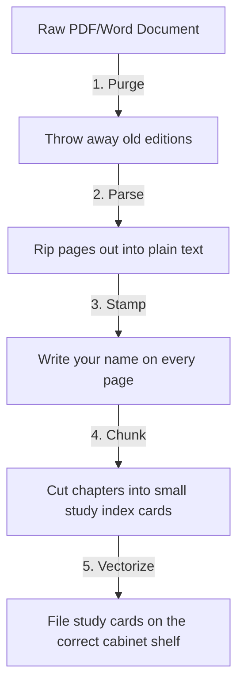

# 📥 Ingestion Mechanics: Parsing, Chunking, and Vector Indexing

This document explains the document ingestion pipeline implemented in [ingest.py](file:///Users/gattuvinaykumar/Documents/intelligent%20Research%20Assistant/research-assistant/backend/api/rag/ingest.py), detailing how the system processes PDFs, Word files, and text documents into searchable vectors.

---

## 🛠️ Step-by-Step Ingestion Code Mechanics

When a user uploads a document, the backend triggers `ingest_documents` in [ingest.py](file:///Users/gattuvinaykumar/Documents/intelligent%20Research%20Assistant/research-assistant/backend/api/rag/ingest.py#L13). Here is the lifecycle of that document:

### Step 1: Purging Old Versions (Avoiding Duplicate/Stale Data)
Before uploading new embeddings, we purge any existing vectors for the same file and user from the Pinecone index:
```python
delete_document_index(user_id, file_name)
```
* **Why it's needed**: If a user uploads `notes.txt` twice, we don't want duplicate chunks in our search results. We clean out the old vectors first.

### Step 2: Parsing (Extracting Raw Text)
The system checks the file extension and dispatches the correct reader:
* **PDF files**: Handled by `PyMuPDFLoader` (PyMuPDF) to extract pages and text lines.
* **Word files (`.doc`/`.docx`)**: Handled by `python-docx` to extract raw paragraphs.
* **Text files (`.txt`)**: Read directly as standard UTF-8 text.

### Step 3: Metadata Stamping (Security Tagging)
Before splitting the text, we tag every chunk with the owner's ID and filename:
```python
for doc in docs:
    doc.metadata.update({"file_name": file_name, "user_id": user_id})
```
* **Why it's needed**: This is the foundation of our multi-user security. Without these tags, we wouldn't be able to filter searches by user.

### Step 4: Chunking (Splitting Text)
We use LangChain's `RecursiveCharacterTextSplitter` to cut the text:
```python
splits = RecursiveCharacterTextSplitter(chunk_size=1000, chunk_overlap=200).split_documents(docs)
```
* **Chunk Size (`1000`)**: The maximum number of characters per chunk.
* **Overlap (`200`)**: The buffer size between chunks to prevent sentences from being cut in half without context.

### Step 5: Creating the Index (If it doesn't exist)
The code checks Pinecone and creates a serverless vector index with **1024 dimensions** and **cosine similarity** metric:
```python
if PINECONE_INDEX_NAME not in [idx.name for idx in pc.list_indexes()]:
    pc.create_index(
        name=PINECONE_INDEX_NAME,
        dimension=1024,
        metric="cosine",
        spec=ServerlessSpec(cloud="aws", region="us-east-1"),
    )
```

### Step 6: Vectorization & Upload (Embedding)
The text chunks are passed to the Pinecone embedding model (`llama-text-embed-v2`), which converts text into mathematical coordinates (vectors), and uploads them to the index:
```python
embeddings = PineconeEmbeddings(model="llama-text-embed-v2", pinecone_api_key=PINECONE_API_KEY)
PineconeVectorStore.from_documents(splits, embeddings, index_name=PINECONE_INDEX_NAME)
```

---

## 🧠 What are Vectors and Dimensions?

To understand how Pinecone stores and compares your files, you need to understand vectors and dimensions:

### 1. What is an Embedding Vector?
When the embedding model processes a text chunk, it converts the words into a list of numbers representing the semantic meaning of that chunk:
$$\text{Vector} = [0.12, -0.45, 0.89, \dots]$$

### 2. What is a "Dimension"?
A **dimension** is the **length of that list of numbers**. It represents the number of traits or "clues" the AI uses to describe the meaning of the text.
* **The Personality Traits Analogy**:
  * **Low-Dimension (3 Dimensions)**: You score a person on only 3 broad traits: `[Friendly, Creative, Athletic]`. Bob's profile is `[0.9, 0.2, 0.8]`.
  * **High-Dimension (1024 Dimensions)**: You score a person on 1024 highly-detailed traits: `[Likes coffee, Wakes up early, Speaks quietly, ... 1021 more traits]`. This gives you a much more precise description of who Bob is.
* **In GraphLens AI**: The `llama-text-embed-v2` model uses **1024 dimensions**. Every text chunk becomes a list of exactly 1024 numbers.

### 3. Why does the Pinecone Index care about Dimensions?
When the index is created, we configure it with `dimension=1024`. This is a strict rule. It tells Pinecone to set up its database geometry to handle exactly 1024-dimensional math. If you try to upload a vector with a different dimension (e.g. 512), Pinecone will reject it with a **Bad Request** error.

---

## 🗺️ Simple Analogy: The Textbook Study Cards

Think of document ingestion like preparing a thick textbook for a study session:



1. **Purging**: You throw away any outdated editions of the textbook from your desk so you don't read wrong facts.
2. **Parsing (Ripping)**: You rip the bound pages out of the book so they are easy to read and manipulate as plain text.
3. **Stamping (Metadata)**: You write your student ID (`user_id`) and the book title (`file_name`) on the back of *every page* so they don't get mixed up with other students' notes.
4. **Chunking**: You cut the pages into small study index cards of `1000` letters with a `200` letter overlap so you can read them quickly.
5. **Vectorizing & Uploading**: You file the study cards in your storage cabinet (Pinecone Index) sorted by topic coordinates.
