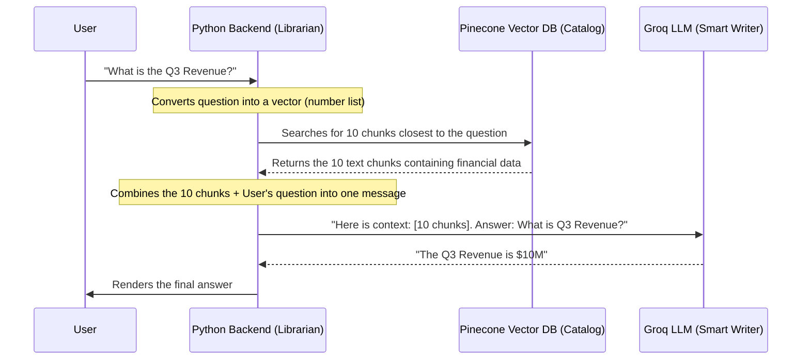

# 🔍 Retrieval Mechanics: Pinecone Index, VectorStore, and Retrievers

This document explains the core retrieval mechanics of the **GraphLens AI** system, specifically clarifying the differences between the database, the connector, and the retrieval configurations implemented in [retrieve.py](file:///Users/gattuvinaykumar/Documents/intelligent%20Research%20Assistant/research-assistant/backend/api/rag/retrieve.py).

---

## 🏛️ Pinecone Index vs. VectorStore

To understand how the system manages embeddings, think of a **physical library system**:

### 1. Pinecone Index (The Library Building)
* **What it is**: The actual physical database hosted on Pinecone's cloud servers.
* **What it does**: It stores the mathematical vectors (embeddings) and raw text chunks on disk.
* **Analogy**: The physical library building containing shelves of books.

### 2. VectorStore (The Catalog System Client)
* **What it is**: The Python connection class (`PineconeVectorStore` from LangChain) running in your Django app.
* **What it does**: It provides a Python API to insert, delete, or query the Pinecone index.
* **Analogy**: The library card catalog system. It isn't the building itself, but it allows your Python backend to talk to the building.

---

## 🔑 `get_vectorstore()` vs. 🔍 `get_retriever()`

In [retrieve.py](file:///Users/gattuvinaykumar/Documents/intelligent%20Research%20Assistant/research-assistant/backend/api/rag/retrieve.py), these two helper functions perform very different roles:

### `get_vectorstore()` — *The Connection Pool*
* **What it does**: Establishes a raw connection to Pinecone. It registers the API key, index name (`research-assistant`), and the embedding model (`llama-text-embed-v2`) used to convert text queries into vectors.
* **Analogy**: **Unlocking the front doors of the library**. It does not perform a search; it just ensures the database is open and accessible.

### `get_retriever()` — *The Search Policy*
* **What it does**: Takes the connection from `get_vectorstore()` and configures **how** searches should run. It adds:
  1. **Security Filters**: Restricts queries strictly to `user_id` and the selected `file_name` to prevent cross-user data leaks.
  2. **Search Type**: Uses **MMR (Maximum Marginal Relevance)** to retrieve a diverse set of chunks and avoid redundant information.
  3. **Chunk Count**: Sets `"k": 10` to retrieve the top 10 most relevant chunks.
* **Analogy**: **Hiring a specific librarian** and giving them strict search rules: *"Go into the library (VectorStore) and fetch 10 diverse articles about this question, but you are only allowed to look at Alice's shelf (user_id filter)."*

---

## 🛠️ Step-by-Step Retrieval Code Mechanics

In your codebase, the retrieval is configured inside the `get_retriever` function in [retrieve.py](file:///Users/gattuvinaykumar/Documents/intelligent%20Research%20Assistant/research-assistant/backend/api/rag/retrieve.py#L33):

### Step 1: The Metadata Filter (Finding the right files)
First, the code builds a security filter so we only look at files belonging to the logged-in user:
```python
filters = {"user_id": {"$eq": user_id}}
if file_name:
    filters["file_name"] = {"$eq": file_name.strip()}
```
This tells Pinecone: *"Only search chunks where `user_id` matches the user and `file_name` matches the active document."*

### Step 2: The Search Method (MMR)
Instead of standard search, your code uses a search type called **MMR (Maximum Marginal Relevance)**:
```python
return vectorstore.as_retriever(search_type="mmr", search_kwargs={"k": 10, "filter": filters})
```

* **What is MMR?** 
  If you do a normal search for a question like *"How do I bake a cake?"*, you might get 5 chunks that say the exact same thing: *"Preheat the oven to 350 degrees."* This is redundant.
  **MMR** solves this by choosing chunks that are **highly relevant** to the question, but **different from each other**. It ensures the LLM gets diverse information (e.g. one chunk about ingredients, one about oven temperature, and one about baking time).
* **How many chunks?** 
  In your code, it actually retrieves **10 chunks** (`"k": 10`) to provide a richer, more detailed context to the LLM.

### 🗺️ Simple Analogy (How it runs in Pinecone):
Imagine your document chunks are plotted as points on a map (vector space). 
1. Python converts your question into a point on that map.
2. Pinecone calculates the physical distance (using **Cosine Similarity**) between your question point and all the document chunk points.
3. Pinecone filters out any points that don't belong to your `user_id`.
4. Using MMR, it picks the **10 closest points** that are spread out from each other (to avoid duplicates) and returns their plain text.

---

## 🔄 The Complete Query Workflow

When a user asks: *"What is the Q3 Revenue?"*:


